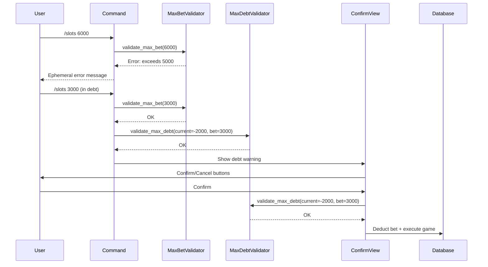

# Design Document: Debt Redemption System

## Overview

The Debt Redemption System extends the Discord casino bot with economic safeguards and recovery mechanics. It introduces two economic firewalls (MAX_BET and MAX_DEBT) to prevent catastrophic losses, three redemption commands (/work, /scratch, /yolo) that provide players with paths out of debt through labor and luck-based mechanics, a global midnight reset system based on Malaysia Time (UTC+8), an updated /daily command with increased rewards, and a PvP robbery mechanic (/rob).

The design integrates seamlessly with the existing codebase by:
- Adding validation layers to existing gambling commands (/slots, /bj, /ht)
- Following established patterns for debt confirmation views
- Using the existing database schema with minimal additions (last_rob_date, rob_count columns)
- Implementing a timezone-aware reset system that replaces individual cooldowns
- Maintaining consistency with the bot's ephemeral messaging and error handling conventions

## Architecture

### High-Level Component Diagram

```mermaid
graph TB
    subgraph "User Commands"
        SLOTS[/slots]
        BJ[/bj]
        HT[/ht]
        WORK[/work]
        SCRATCH[/scratch]
        YOLO[/yolo]
    end
    
    subgraph "Economic Firewalls"
        MAXBET[MAX_BET Validator]
        MAXDEBT[MAX_DEBT Validator]
    end
    
    subgraph "Existing Components"
        HTVIEW[HTDebtConfirmView]
        BJVIEW[BjDebtConfirmView]
        SLOTSVIEW[SlotsDebtConfirmView]
    end
    
    subgraph "Database Layer"
        DB[(user_gold table)]
    end
    
    SLOTS --> MAXBET
    BJ --> MAXBET
    HT --> MAXBET
    
    MAXBET --> MAXDEBT
    
    MAXDEBT --> HTVIEW
    MAXDEBT --> BJVIEW
    MAXDEBT --> SLOTSVIEW
    
    HTVIEW --> DB
    BJVIEW --> DB
    SLOTSVIEW --> DB
    
    WORK --> DB
    SCRATCH --> DB
    YOLO --> DB
```

### Integration Points

1. **Gambling Command Entry Points**: /slots, /bj, /ht commands will call firewall validators before processing bets
2. **Debt Confirmation Views**: HTDebtConfirmView, BjDebtConfirmView, and SlotsDebtConfirmView will call MAX_DEBT validator before executing the bet
3. **Database Layer**: All redemption commands use existing get_gold/add_gold helpers with parameterized queries

### Data Flow



## Components and Interfaces

### Economic Firewall Validators

#### MAX_BET Validator

```python
MAX_BET: int = 5000

def validate_max_bet(bet: int) -> tuple[bool, str | None]:
    """
    Validate that a bet does not exceed the maximum allowed bet.
    
    Args:
        bet: The bet amount to validate
        
    Returns:
        (is_valid, error_message)
        - (True, None) if bet is valid
        - (False, error_message) if bet exceeds MAX_BET
    """
```

#### MAX_DEBT Validator

```python
MAX_DEBT: int = -10000

def validate_max_debt(
    guild_id: int,
    user_id: int,
    bet: int,
    in_debt: bool
) -> tuple[bool, str | None]:
    """
    Validate that a bet will not push the player below MAX_DEBT.
    
    Only applies to players already in debt (gold <= 0).
    Calculates potential balance as: current_gold - (bet * 1.3)
    
    Args:
        guild_id: Discord guild ID
        user_id: Discord user ID
        bet: The bet amount
        in_debt: Whether the player is currently in debt
        
    Returns:
        (is_valid, error_message)
        - (True, None) if bet is valid
        - (False, error_message) if bet would exceed MAX_DEBT
    """
```

### Redemption Commands

#### Malaysia Time (MYT) Timezone Helper

```python
from datetime import datetime, timezone, timedelta

# Malaysia Time (UTC+8)
MYT = timezone(timedelta(hours=8))

def get_today_myt() -> str:
    """
    Get the current date in Malaysia Time (UTC+8).
    
    Returns:
        String formatted as 'YYYY-MM-DD' representing today's date in MYT
    """
    now_myt = datetime.now(MYT)
    return now_myt.strftime('%Y-%m-%d')
```

#### /daily Command (Updated)

```python
DAILY_REWARD: int = 500  # Updated from 300 to 500

@bot.tree.command(name="daily", description="Claim 500 Gold — resets at midnight MYT")
async def cmd_daily(interaction: discord.Interaction) -> None:
    """
    Award 500 gold to the player once per day (resets at midnight MYT).
    
    Uses MYT timezone reset instead of 24-hour cooldown.
    
    Validates:
        - Guild context required
        - Player hasn't claimed today (based on MYT date)
        
    Database operations:
        - Read last_daily date
        - Update gold balance (+500)
        - Update last_daily to today's MYT date
    """
```

#### /work Command

```python
WORK_REWARD: int = 50
ROLEX_PROBABILITY: float = 0.01  # 1/100

@bot.tree.command(name="work", description="Wash dishes to earn 50 Gold (no cooldown)")
async def cmd_work(interaction: discord.Interaction) -> None:
    """
    Award 50 gold to the player with a 1% chance of Rolex event.
    
    No cooldown - can be used unlimited times.
    Rolex event: If player is in debt, set gold to 0 (debt forgiveness).
    
    Validates:
        - Guild context required
        
    Database operations:
        - Read current gold balance
        - Update gold balance (+50 or set to 0)
    """
```

#### /scratch Command

```python
SCRATCH_JACKPOT_PROBABILITY: float = 0.01  # 1/100

@bot.tree.command(name="scratch", description="Free scratch card for broke players (resets at midnight MYT)")
async def cmd_scratch(interaction: discord.Interaction) -> None:
    """
    Daily scratch card lottery for players in debt.
    
    Eligibility: gold < 0
    Jackpot (1% chance): Set gold to 0 (debt forgiveness)
    Resets at midnight MYT (not 24-hour cooldown)
    
    Validates:
        - Guild context required
        - Player must be in debt (gold < 0)
        - Player hasn't used /scratch today (MYT date check)
        
    Database operations:
        - Read current gold balance
        - Read last_scratch_date
        - Update gold balance (set to 0 on jackpot)
        - Update last_scratch_date to today's MYT date
    """
```

#### /yolo Command

```python
YOLO_ELIGIBILITY_THRESHOLD: int = -1000
YOLO_WIN_PROBABILITY: float = 0.10  # 10/100
YOLO_WIN_REWARD: int = 2000
YOLO_LOSE_MULTIPLIER: float = 1.5

@bot.tree.command(name="yolo", description="Russian roulette for desperate players (resets at midnight MYT)")
async def cmd_yolo(interaction: discord.Interaction) -> None:
    """
    High-risk high-reward option for players in deep debt.
    
    Eligibility: gold <= -1000
    Win (10% chance): Set gold to 2000
    Lose (90% chance): Multiply current debt by 1.5
    Resets at midnight MYT (not 24-hour cooldown)
    
    Validates:
        - Guild context required
        - Player must have gold <= -1000
        - Player hasn't used /yolo today (MYT date check)
        
    Database operations:
        - Read current gold balance
        - Read last_yolo_date
        - Update gold balance (set to 2000 or multiply by 1.5)
        - Update last_yolo_date to today's MYT date
    """
```

#### /rob Command

```python
ROB_SUCCESS_RATE: float = 0.40  # 40% success
ROB_DAILY_LIMIT: int = 3
ROB_STEAL_MIN: float = 0.10  # 10% of target's gold
ROB_STEAL_MAX: float = 0.20  # 20% of target's gold
ROB_DEBT_PENALTY: float = 1.5  # 50% increase in debt

@bot.tree.command(name="rob", description="Rob another player (3 times per day, resets at midnight MYT)")
@app_commands.describe(target="The player you want to rob")
async def cmd_rob(interaction: discord.Interaction, target: discord.Member) -> None:
    """
    PvP robbery mechanic with daily limit and risk/reward.
    
    Daily limit: 3 robs per day (resets at midnight MYT)
    Success (40%): Steal 10-20% of target's gold
    Fail (60%): 
        - If robber has gold > 0: Pay all gold as bail
        - If robber has gold <= 0: Debt increases by 50%
    
    Validates:
        - Guild context required
        - Robber is not targeting themselves
        - Target has gold > 0
        - Robber hasn't exceeded 3 robs today (MYT date check)
        
    Database operations:
        - Read robber's last_rob_date and rob_count
        - Read robber's and target's gold balances
        - Update rob_count (increment by 1)
        - Update last_rob_date to today's MYT date
        - Update gold balances based on success/fail outcome
    """
```

### Integration with Existing Commands

#### /slots Integration

```python
async def cmd_slots(interaction: discord.Interaction, bet: int) -> None:
    """
    Modified to include economic firewall validation.
    
    New validation flow:
    1. Check guild context
    2. Validate bet > 0
    3. Validate MAX_BET (new)
    4. Check if player is in debt
    5. If in debt, show SlotsDebtConfirmView (existing)
    6. Otherwise, execute immediately
    """
```

Modification points:
- After `bet <= 0` check, add `validate_max_bet(bet)` call
- Before showing SlotsDebtConfirmView, add `validate_max_debt()` call

#### /bj Integration

```python
async def cmd_bj(interaction: discord.Interaction, bet: int = 0) -> None:
    """
    Modified to include economic firewall validation.
    
    New validation flow:
    1. Check guild context
    2. Validate bet >= 0
    3. If bet > 0, validate MAX_BET (new)
    4. Check if player is in debt
    5. If in debt, show BjDebtConfirmView (existing)
    6. Otherwise, proceed to lobby
    """
```

Modification points:
- After `bet < 0` check, add `validate_max_bet(bet)` call for bet > 0
- In BjDebtConfirmView.confirm(), add `validate_max_debt()` call before adding player to table

#### /ht Integration

```python
async def cmd_cointoss(
    interaction: discord.Interaction,
    choice: Literal["heads", "tails"],
    bet: int = 0,
) -> None:
    """
    Modified to include economic firewall validation.
    
    New validation flow:
    1. Check guild context
    2. Check if free play (bet == 0)
    3. If staked, validate bet > 0
    4. Validate MAX_BET (new)
    5. Check if player is in debt
    6. If in debt, show HTDebtConfirmView (existing)
    7. Otherwise, execute immediately
    """
```

Modification points:
- After `bet_amount <= 0` check (for non-free-play), add `validate_max_bet(bet_amount)` call
- Before showing HTDebtConfirmView, add `validate_max_debt()` call

#### Debt Confirmation Views Integration

All three debt confirmation views (HTDebtConfirmView, BjDebtConfirmView, SlotsDebtConfirmView) need MAX_DEBT validation in their confirm() methods:

```python
class HTDebtConfirmView(ui.View):
    @ui.button(label="▶️ Continue (30% interest applies)", style=discord.ButtonStyle.danger)
    async def confirm(self, interaction: discord.Interaction, button: ui.Button) -> None:
        # ... existing checks ...
        
        # NEW: Validate MAX_DEBT before executing bet
        is_valid, error_msg = validate_max_debt(
            self.guild_id, self.uid, self.bet_amount, in_debt=True
        )
        if not is_valid:
            await interaction.response.send_message(error_msg, ephemeral=True)
            return
        
        # ... existing bet execution ...
```

Similar modifications for BjDebtConfirmView and SlotsDebtConfirmView.

## Data Models

### Database Schema

The system uses the existing `user_gold` table with additional columns:

```sql
CREATE TABLE IF NOT EXISTS user_gold (
    guild_id       BIGINT  NOT NULL,
    user_id        BIGINT  NOT NULL,
    gold           INTEGER NOT NULL DEFAULT 0,
    last_daily     TEXT,
    last_scratch_date TEXT,
    last_yolo_date    TEXT,
    last_rob_date     TEXT,
    rob_count         INTEGER NOT NULL DEFAULT 0,
    PRIMARY KEY (guild_id, user_id)
)
```

**New columns added:**
- `last_scratch_date` (TEXT): Stores the MYT date (YYYY-MM-DD) when player last used /scratch
- `last_yolo_date` (TEXT): Stores the MYT date (YYYY-MM-DD) when player last used /yolo
- `last_rob_date` (TEXT): Stores the MYT date (YYYY-MM-DD) when player last used /rob
- `rob_count` (INTEGER): Number of times player has used /rob today (resets at midnight MYT)

**Modified columns:**
- `last_daily` (TEXT): Now stores MYT date (YYYY-MM-DD) instead of ISO timestamp

### MYT Reset Logic

All daily mechanics use the same reset pattern:

1. Fetch the relevant `last_X_date` column from database
2. Compare with `get_today_myt()` result
3. If dates match → command already used today, block execution
4. If dates don't match → allow execution, update `last_X_date` to `get_today_myt()`

For `/rob` specifically:
- If `last_rob_date != get_today_myt()`: Reset `rob_count` to 0 and update `last_rob_date`
- Check if `rob_count >= 3`: If yes, block execution
- After successful validation: Increment `rob_count` by 1

### Constants

```python
# Timezone
from datetime import datetime, timezone, timedelta
MYT = timezone(timedelta(hours=8))

# Economic Firewalls
MAX_BET: int = 5000
MAX_DEBT: int = -10000

# Daily Command
DAILY_REWARD: int = 500  # Updated from 300

# Work Command
WORK_REWARD: int = 50
ROLEX_PROBABILITY: float = 0.01  # 1/100

# Scratch Command
SCRATCH_JACKPOT_PROBABILITY: float = 0.01  # 1/100

# YOLO Command
YOLO_ELIGIBILITY_THRESHOLD: int = -1000
YOLO_WIN_PROBABILITY: float = 0.10  # 10/100
YOLO_WIN_REWARD: int = 2000
YOLO_LOSE_MULTIPLIER: float = 1.5

# Rob Command
ROB_SUCCESS_RATE: float = 0.40  # 40% success
ROB_DAILY_LIMIT: int = 3
ROB_STEAL_MIN: float = 0.10  # 10% of target's gold
ROB_STEAL_MAX: float = 0.20  # 20% of target's gold
ROB_DEBT_PENALTY: float = 1.5  # 50% increase in debt when caught
```


## Correctness Properties

*A property is a characteristic or behavior that should hold true across all valid executions of a system—essentially, a formal statement about what the system should do. Properties serve as the bridge between human-readable specifications and machine-verifiable correctness guarantees.*

### Property 1: MAX_BET Enforcement

*For any* gambling command (/slots, /bj, /ht) and any bet amount greater than 5000, the system should reject the bet and return an error message indicating the maximum bet is 5000 gold.

**Validates: Requirements 1.2, 1.3, 1.4, 1.5**

### Property 2: MAX_DEBT Calculation

*For any* player in debt and any bet amount, when calculating the potential new balance, the system should compute it as: current_gold - (bet × 1.3).

**Validates: Requirements 2.2**

### Property 3: MAX_DEBT Enforcement

*For any* player in debt and any bet where the potential balance (current_gold - bet × 1.3) would be less than -10000, the system should reject the bet and return a warning message about maxed credit limit.

**Validates: Requirements 2.3, 2.4, 2.5, 2.6, 2.7, 2.8**

### Property 4: Work Reward Consistency

*For any* player executing /work when the Rolex event does not trigger, the system should increase the player's gold balance by exactly 50.

**Validates: Requirements 3.3**

### Property 5: Rolex Event Probability

*For any* large sample of /work executions (n ≥ 1000), the Rolex event should trigger approximately 1% of the time (within statistical tolerance of ±0.5%).

**Validates: Requirements 3.6**

### Property 6: Scratch Eligibility Enforcement

*For any* player with gold balance greater than or equal to 0, the /scratch command should reject the request with an error message.

**Validates: Requirements 4.3, 4.4**

### Property 7: Scratch Jackpot Probability

*For any* large sample of /scratch executions by eligible players (n ≥ 1000), the jackpot event should trigger approximately 1% of the time (within statistical tolerance of ±0.5%).

**Validates: Requirements 4.6**

### Property 8: YOLO Eligibility Enforcement

*For any* player with gold balance greater than -1000, the /yolo command should reject the request with an error message indicating only desperate players can use it.

**Validates: Requirements 5.3, 5.4**

### Property 9: YOLO Win Probability

*For any* large sample of /yolo executions by eligible players (n ≥ 1000), the win event should trigger approximately 10% of the time (within statistical tolerance of ±1%).

**Validates: Requirements 5.6, 5.9**

### Property 10: YOLO Lose Debt Multiplication

*For any* eligible player executing /yolo when the lose event triggers, the system should multiply the player's current gold by 1.5 (making debt 50% worse).

**Validates: Requirements 5.10**

### Property 11: Guild Context Enforcement

*For any* redemption command (/work, /scratch, /yolo) executed outside a guild context, the system should reject the command and send an ephemeral error message.

**Validates: Requirements 3.10, 3.11, 4.10, 4.11, 5.12, 5.13, 6.5**

### Property 12: Error Message Ephemerality

*For any* validation error (MAX_BET violation, MAX_DEBT violation, eligibility check failure, guild context failure), the system should send the error message with the ephemeral flag set to true.

**Validates: Requirements 6.4**

### Property 13: MYT Date Format Consistency

*For any* call to get_today_myt(), the function should return a string in the format 'YYYY-MM-DD' representing the current date in Malaysia Time (UTC+8).

**Validates: Requirements 7.3, 7.4**

### Property 14: Daily Command MYT Reset

*For any* player who has already claimed /daily today (last_daily == get_today_myt()), the system should reject the command with an appropriate message.

**Validates: Requirements 8.4, 8.5**

### Property 15: Daily Reward Amount

*For any* successful /daily claim, the system should award exactly 500 gold to the player.

**Validates: Requirements 8.6**

### Property 16: Rob Daily Limit Enforcement

*For any* player who has used /rob 3 times today (rob_count >= 3 and last_rob_date == get_today_myt()), the system should reject the command.

**Validates: Requirements 9.5, 9.6**

### Property 17: Rob Success Rate

*For any* large sample of /rob executions (n ≥ 1000), the success rate should be approximately 40% (within statistical tolerance of ±2%).

**Validates: Requirements 9.13**

### Property 18: Rob Steal Amount Range

*For any* successful /rob execution, the steal_amount should be between 10% and 20% of the target's gold balance (inclusive).

**Validates: Requirements 9.14**

### Property 19: Rob Self-Targeting Prevention

*For any* /rob command where the robber targets themselves, the system should reject the command with an error message.

**Validates: Requirements 9.7, 9.8**

### Property 20: Rob Target Validation

*For any* /rob command where the target has gold <= 0, the system should reject the command with an appropriate message.

**Validates: Requirements 9.9, 9.10**

## Error Handling

### Validation Errors

All validation errors follow a consistent pattern:
1. Check fails before any state modification
2. Return ephemeral error message to user
3. No database changes occur
4. Command execution halts

Error categories:
- **MAX_BET Violation**: "❌ Maximum bet is 5,000 💰"
- **MAX_DEBT Violation**: "⚠️ Your Ah Long credit limit is maxed out! Go wash some dishes (/work) to pay off your debt."
- **Eligibility Failure**: Command-specific messages (e.g., "❌ Only broke people in debt can get a free scratch card!")
- **Guild Context Failure**: "This command can only be used in a server."
- **Daily Already Claimed**: "❌ You already claimed your daily relief! Wait until midnight (MYT) for the reset."
- **Rob Daily Limit**: "🛑 Heat is too high! You've already robbed 3 times today. Lay low until midnight."
- **Rob Self-Target**: Ephemeral error indicating player cannot rob themselves
- **Rob Target Too Poor**: "❌ Target is too broke. Even Ah Long is looking for them. Pick someone else!"

### MYT Reset Errors

MYT reset checks are performed at the start of each daily command:
- User receives clear message indicating they must wait until midnight MYT
- No database changes occur when blocked
- Reset happens automatically at midnight MYT (no manual intervention needed)

### Cooldown Errors

**DEPRECATED**: Individual cooldowns have been replaced with MYT reset logic.

The `/work` command has no cooldown and can be used unlimited times.

The `/daily`, `/scratch`, `/yolo`, and `/rob` commands use MYT date-based resets instead of cooldowns.

### Database Errors

Database operations use try-except blocks following existing patterns:
```python
try:
    # Database operation
    add_gold(guild_id, user_id, amount)
except Exception as e:
    # Log error and notify user
    await interaction.response.send_message(
        "❌ An error occurred. Please try again later.",
        ephemeral=True
    )
```

### Race Conditions

Potential race conditions and mitigations:
1. **Concurrent /work executions**: No cooldown, so multiple executions are allowed
2. **Concurrent gambling + redemption**: Database transactions ensure consistency
3. **Balance checks vs. deductions**: All checks happen immediately before deductions in the same execution flow
4. **Concurrent /rob executions**: rob_count increment happens atomically in database transaction
5. **MYT date changes during execution**: get_today_myt() is called once at the start of each command, ensuring consistency within a single execution

## Testing Strategy

### Dual Testing Approach

The system requires both unit tests and property-based tests for comprehensive coverage:

**Unit Tests** focus on:
- Specific examples of each command execution
- Edge cases (exact threshold values like -1000 for /yolo, 0 for /scratch)
- Error conditions (non-guild context, cooldown violations)
- Integration points with existing debt confirmation views
- Message content verification for special events

**Property-Based Tests** focus on:
- Universal validation rules across all inputs (MAX_BET, MAX_DEBT)
- Probability distributions (Rolex, jackpot, YOLO outcomes)
- Balance calculations across random player states
- Eligibility enforcement across random balance ranges

### Property-Based Testing Configuration

**Framework**: Use `hypothesis` for Python property-based testing

**Test Configuration**:
- Minimum 100 iterations per property test (1000 for probability tests)
- Each test tagged with: `# Feature: debt-redemption-system, Property {N}: {description}`
- Random seed control for reproducibility

**Example Property Test Structure**:
```python
from hypothesis import given, strategies as st

@given(bet=st.integers(min_value=5001, max_value=1000000))
def test_max_bet_enforcement(bet):
    """
    Feature: debt-redemption-system, Property 1: MAX_BET Enforcement
    
    For any bet > 5000, validate_max_bet should return (False, error_message)
    """
    is_valid, error_msg = validate_max_bet(bet)
    assert is_valid is False
    assert "5000" in error_msg or "5,000" in error_msg
```

### Unit Test Coverage

Key unit test scenarios:
1. **MAX_BET edge cases**: bet = 5000 (valid), bet = 5001 (invalid)
2. **MAX_DEBT edge cases**: balance = -9999 with bet causing exactly -10000 (valid), -10001 (invalid)
3. **Work command**: Normal execution (+50 gold), Rolex event (debt → 0)
4. **Scratch command**: Eligibility at gold = -1 (valid), gold = 0 (invalid), jackpot event
5. **YOLO command**: Eligibility at gold = -1000 (valid), gold = -999 (invalid), win/lose events
6. **Integration**: Each debt confirmation view calls MAX_DEBT validator correctly

### Test Data Generators

For property-based tests, define custom strategies:
```python
# Player states
in_debt_balance = st.integers(min_value=-50000, max_value=-1)
positive_balance = st.integers(min_value=0, max_value=1000000)
deep_debt_balance = st.integers(min_value=-50000, max_value=-1000)

# Bet amounts
valid_bets = st.integers(min_value=1, max_value=5000)
invalid_bets = st.integers(min_value=5001, max_value=1000000)
```

### Probability Test Methodology

For testing random events (Rolex, jackpot, YOLO):
1. Run command 10,000 times with controlled randomness
2. Count event occurrences
3. Assert frequency within statistical tolerance:
   - 1% events: 0.5% to 1.5% (50 to 150 occurrences in 10k trials)
   - 10% events: 9% to 11% (900 to 1100 occurrences in 10k trials)
4. Use chi-squared test for distribution validation

### Integration Testing

Test integration points with existing commands:
1. **/slots + MAX_BET**: Verify rejection before SlotsDebtConfirmView
2. **/slots + MAX_DEBT**: Verify rejection in SlotsDebtConfirmView.confirm()
3. **/bj + MAX_BET**: Verify rejection before lobby creation
4. **/bj + MAX_DEBT**: Verify rejection in BjDebtConfirmView.confirm()
5. **/ht + MAX_BET**: Verify rejection before HTDebtConfirmView
6. **/ht + MAX_DEBT**: Verify rejection in HTDebtConfirmView.confirm()

### Mock Strategy

For Discord interaction testing:
- Mock `discord.Interaction` objects with test guild_id and user_id
- Mock database calls to isolate command logic
- Mock random number generation for deterministic event testing
- Use `pytest-asyncio` for async command testing
